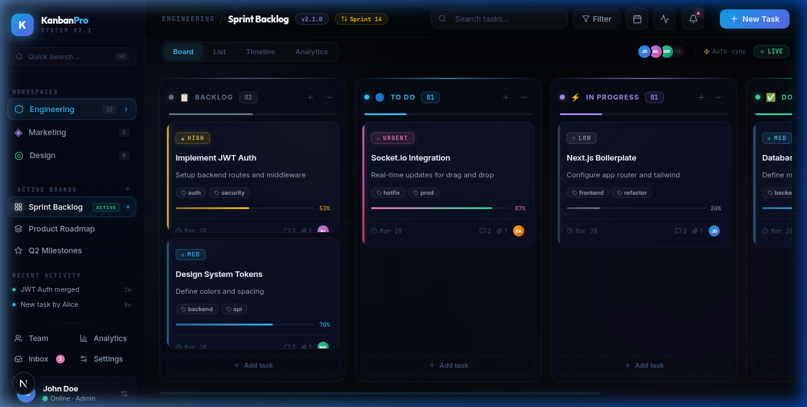

# Kanban Pro — Intelligent Workflow OS

> A next-generation, full-stack Kanban board built for high-performance engineering teams. Real-time collaboration, premium glassmorphism UI, and a powerful task management engine.



---

## ✨ Features

- **🎨 Premium UI** — Glassmorphism design with aurora animated background, neon accents, and micro-animations
- **🔄 Drag & Drop** — Fluid card movement across columns powered by `@hello-pangea/dnd`
- **⚡ Real-time Sync** — WebSocket integration for live collaboration (Socket.io)
- **🔐 Auth System** — JWT-based authentication with protected routes
- **📊 Progress Tracking** — Per-card progress bars, priority badges, and assignee avatars
- **🗂️ Multi-Board** — Support for multiple workspaces (Engineering, Marketing, Design)
- **🏷️ Tags & Priorities** — Smart tagging with LOW / MED / HIGH / URGENT priority levels
- **🌙 Full Dark Mode** — Purpose-built dark theme with deep navy palette

---

## 🖥️ Tech Stack

| Layer        | Technology                          |
|--------------|-------------------------------------|
| **Frontend** | Next.js 16 (App Router), TypeScript |
| **Styling**  | Tailwind CSS + Vanilla CSS (custom) |
| **Backend**  | Node.js, Express, TypeScript        |
| **Database** | PostgreSQL + Prisma ORM             |
| **Auth**     | JWT (jsonwebtoken)                  |
| **Realtime** | Socket.io                           |
| **Deploy**   | Docker + Docker Compose             |

---

## 🚀 Getting Started

### Prerequisites

- Node.js 18+
- Docker & Docker Compose
- PostgreSQL (or use the bundled Docker service)

### 1. Clone & configure

```bash
git clone <repo-url>
cd kanban-pro
cp .env.example .env   # edit with your DB credentials
```

### 2. Start with Docker (recommended)

```bash
docker compose up -d
```

This starts:
- **PostgreSQL** on port `5432`
- **Backend API** on port `4000`
- **Frontend** on port `3000`

### 3. Run locally (dev mode)

**Backend:**
```bash
cd backend
npm install
npm run dev
```

**Frontend:**
```bash
cd frontend
npm install
npm run dev
```

Open [http://localhost:3000](http://localhost:3000) in your browser.

---

## 📁 Project Structure

```
kanban-pro/
├── frontend/               # Next.js App
│   └── src/
│       ├── app/            # Pages & global styles
│       ├── components/     # KanbanBoard, Column, Card, Layout
│       ├── store/          # Zustand state management
│       ├── services/       # API client
│       └── hooks/          # Custom React hooks
│
├── backend/                # Express API
│   └── src/
│       ├── routes/         # Auth, boards, cards
│       ├── middleware/      # JWT auth guard
│       └── prisma/         # DB schema & migrations
│
├── docker-compose.yml
└── screenshot.png
```

---

## 🎨 Design System

The UI uses a curated dark palette with neon accents:

| Token          | Value       | Usage                |
|----------------|-------------|----------------------|
| `--neon-blue`  | `#38bdf8`   | Primary / To Do      |
| `--neon-purple`| `#a78bfa`   | In Progress          |
| `--neon-green` | `#34d399`   | Done / Online status |
| `--neon-rose`  | `#f472b6`   | Urgent / Alerts      |
| `--neon-amber` | `#fbbf24`   | High priority        |
| `--bg-base`    | `#030508`   | Page background      |

Fonts: **Inter** (UI) · **Outfit** (headings) · **JetBrains Mono** (code/badges)

---

## 🐳 Docker Services

```yaml
services:
  postgres:   # PostgreSQL 15
  backend:    # Express API on :4000
  frontend:   # Next.js on :3000
```

---

## 📄 License

MIT — feel free to use, modify and distribute.
